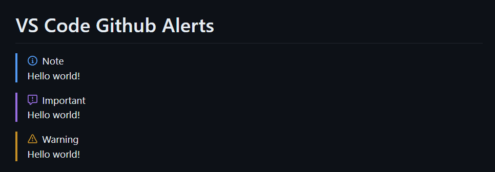

# VS Code Markdown Alert

This is a VS Code extension that allows you to preview GitHub's alert syntax for markdown files. This feature first introduced in [this discussion post](https://github.com/orgs/community/discussions/16925). And this extension is the first implementation of this feature in VS Code.

You can install the extension from [VS Code Marketplace](https://marketplace.visualstudio.com/items?itemName=yahyabatulu.vscode-markdown-alert).

Syntax below,

```MD
> [!NOTE]
> Hello, world!
```

should look like this,

> [!NOTE]
> Hello, world!

And this it looks like in VS Code via this extension,



## How does it work?

For those who are interested in how this extension works, here is a brief explanation.

VS Code uses a javascript library named [markdown-it](https://github.com/markdown-it/markdown-it) to render markdown files. This library allows you to add custom rules to the markdown parser. This extension adds a custom rule to the parser to render GitHub's alert syntax using [markdown-it-github-alert](https://github.com/ByPikod/markdown-it-github-alert) plugin of Markdown-it which is also written by me.

For further information, you can check out the source code of this extension and the plugin.

## Contribute

Contribution

We welcome and appreciate contributions from the community! To contribute to this project, follow these steps:

* Fork the repository.
* Create a new branch for your feature or bug fix.
* Make your changes and ensure they pass any existing tests.
* Open a pull request with a clear title and description.
* Participate in the code review process.

Thank you for helping make this project better!

## Copyright

This project is licensed under the terms of the MIT License.

You are free to use this project in compliance with the MIT License. If you decide to use, modify, or redistribute this software, you must include a copy of the original license and copyright notice in all copies or substantial portions of the software.

For more information about the MIT License, visit: [MIT License](LICENSE).

**Enjoy!**
