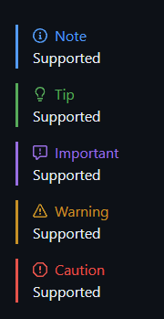

# VS Code Markdown Alert

This is a VS Code extension that allows you to preview GitHub's alert syntax for markdown files. This feature first introduced in [this discussion post](https://github.com/orgs/community/discussions/16925). And this extension is the first implementation of this feature in VS Code.

This code,

```MD
> [!NOTE]
> Hello, world!
```

should look like this,


Here is an example how it looks like in VS Code,



## How does it work?

For those who are interested in how this extension works, here is a brief explanation.

VS Code uses a javascript library named [markdown-it](https://github.com/markdown-it/markdown-it) to render markdown files. This library allows you to add custom rules to the markdown parser. This extension adds a custom rule to the parser to render GitHub's alert syntax using [markdown-it-github-alert](https://github.com/ByPikod/markdown-it-github-alert) plugin of Markdown-it which is also written by me.

For further information, you can check out the source code of this extension and the plugin.

## Copyright

This project is licensed under the terms of the MIT License.

You are free to use this project in compliance with the MIT License. If you decide to use, modify, or redistribute this software, you must include a copy of the original license and copyright notice in all copies or substantial portions of the software.

For more information about the MIT License, visit: [MIT License](LICENSE).

**Enjoy!**
